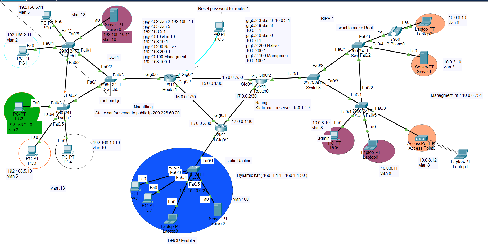

# Enterprise Network Infrastructure — NTI Final Project

A multi-site enterprise network built and configured in Cisco Packet Tracer as the final project for the **NTI Network Infrastructure** course. The design covers routing, switching, security, and network services across three routers, six switches, an access point, and a VoIP endpoint.



## Project Requirements

The project brief called for a network implementing:

- Full device hardening: hostname, privileged/console/SSH passwords, enable secret, and login banners on every router and switch
- Per-switch native VLAN (VLAN 200) and management SVI (VLAN 100) with a default gateway
- Fully documented and described router interfaces, with IP addressing on every end device
- End-to-end verification (`ping`, `traceroute`, `show ip interface brief`, `show ip route`, `show interfaces`, `show mac-address-table`, `arp -a`, `ipconfig`)
- Access control lists restricting specific host-to-host traffic
- A mixed routing design: static routing, OSPF, and RIPv2
- Static NAT, dynamic NAT, and PAT
- Router-on-a-stick inter-VLAN routing
- Switch security: port security, DHCP snooping, and ARP inspection
- Spanning Tree Protocol tuning (root bridge election)
- Wireless access via an Access Point
- Network services: DHCP, TFTP, Syslog, NTP, and SNMP servers
- CDP/LLDP verification between neighboring devices

## Topology Overview

The network is split across two /8-style private addressing domains connected through three 2911 routers over point-to-point WAN links, with a third router providing DHCP-served access to a separate management subnet:

| Router | Role | WAN Interfaces | Routing | NAT |
|---|---|---|---|---|
| **R1** (HQ) | Core router for the 192.168.x.x campus (VLANs 2, 5, 10, 100, 200) | Gi0/1 → 15.0.0.1/30, Gi0/2 → 16.0.0.1/30 | OSPF area 0 | Static NAT ×2 (customer VLAN 10 host → two public IPs) |
| **Router0** | Core router for the 10.0.x.x campus (VLANs 3, 6, 8, 100, 200) | Gi0/0 → 15.0.0.2/30, Gi0/1 → 17.0.0.2/30 | OSPF area 0 **and** RIPv2 | Static NAT (10.0.3.10 → 150.1.1.7) |
| **Router2** | Branch/management router with DHCP-served clients (172.10.10.0/24) | Gi0/0 → 16.0.0.2/30, Gi0/1 → 17.0.0.1/30 | Static routing only | Dynamic NAT pool (160.1.1.1–160.1.1.50) |

Six Layer 3 switches provide access and distribution, split evenly across the two campuses, each with a management SVI on VLAN 100 (192.168.100.x on the HQ side, 10.0.100.x on the Router0 side) and STP priority tuning to force a predictable root bridge on each side.

## VLAN Addressing

| VLAN | Purpose | Subnet | Campus |
|---|---|---|---|
| 2 | HR Network | 192.168.2.0/24 | HQ (R1) |
| 5 | Shipment Network | 192.168.5.0/24 | HQ (R1) |
| 10 | Customer Network | 192.168.10.0/24 | HQ (R1) |
| 3 | — | 10.0.3.0/24 | Router0 |
| 6 | — | 10.0.6.0/24 | Router0 |
| 8 | — | 10.0.8.0/24 | Router0 |
| 100 | Management | 192.168.100.0/24 / 10.0.100.0/24 | Both |
| 200 | Native VLAN | 192.168.200.0/24 / 10.0.200.0/24 | Both |
| 100 (Router2 side) | DHCP-served management | 172.10.10.0/24 | Router2 |

## Security Policies

Two access lists deliberately restrict specific host pairs to demonstrate ACL filtering:

- **R1 — ACL 102**: denies ICMP from a specific HR host (192.168.2.10) to the Router0-side server (150.1.1.7), while permitting everything else — that host can reach the server by other protocols (e.g. FTP) but can't ping it.
- **Router0 — ACL 110**: denies FTP (TCP/21) from a specific host (10.0.8.10) to the R1-side server (209.226.60.20) while explicitly permitting ICMP and all other traffic — that host can ping the server but can't FTP to it.

This produces the asymmetric reachability behavior called out in the verification notes (one PC can ping but not FTP a server; another can FTP but not ping).

Additional hardening: SSH v2 + local login on R1, SNMP RO/RW community strings for monitoring, and syslog/NTP pointed at the internal servers.

## NAT Summary

| Router | Type | Detail |
|---|---|---|
| R1 | Static | 192.168.10.11 → 209.165.201.5 |
| R1 | Static | 192.168.10.11 → 209.226.60.20 |
| Router0 | Static | 10.0.3.10 → 150.1.1.7 |
| Router2 | Dynamic (pool) | Inside hosts matching ACL 1 → 160.1.1.1–160.1.1.50 |

## Repo Structure

```
nti-network-project/
├── README.md
├── topology-diagram.png
├── project.pkt                  # add your Packet Tracer file here
└── configs/
    ├── R1-running-config.txt
    ├── Router0-running-config.txt
    ├── Router2-running-config.txt
    ├── Switch0-running-config.txt   # HQ campus — STP root bridge, distribution
    ├── Switch1-running-config.txt   # HQ campus — access (VLANs 2, 5, 10)
    ├── Switch2-running-config.txt   # HQ campus — access (VLANs 2, 5, 10)
    ├── Switch3-running-config.txt   # Router0 campus — distribution
    ├── Switch4-running-config.txt   # Router0 campus — STP root bridge, access (VLANs 3, 6)
    └── Switch5-running-config.txt   # Router0 campus — access (VLAN 8)
```

## Skills Demonstrated

Static & dynamic routing (OSPF, RIPv2, static routes) · VLANs & trunking (802.1Q, native VLAN) · Router-on-a-stick · Static NAT, dynamic NAT, PAT · Standard & extended ACLs · Spanning Tree root bridge tuning · SSH/AAA device hardening · SNMP, NTP, Syslog · DHCP · Network documentation & verification
